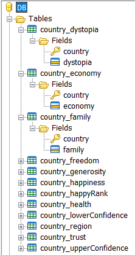
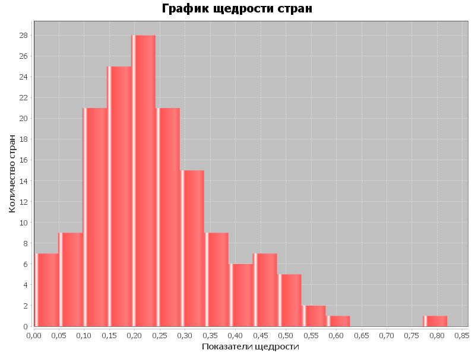
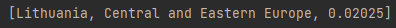

# Итоговый проект Java
### Костровский Александр 
### Вариант 10. Показатели стран 2016.

## Последовательность работы:
1. С помощью программы sqliteadmin была создана БД **db.s3db**
2. Был создан класс Database с методами для работы с данной БД
3. Также был создан класс EntryParser для парсинга данного в условии задачи .csv файла
4. Был создан класс Entry, для удобного хранения результатов парсинга
5. Далее был создан и использован метод **MoveCSVToDB**, который последовательно:
создаёт таблицу для определённого показателя страны в .csv файле, переносит данные из .csv
файла в БД 
 
*На скриншоте приведён список созданных таблиц*
6. Был создан и использован метод **CreateAndSaveHistogram**, который создаёт график
показателя щедрости стран и сохраняет его в файл **histogram.png** 
 
*Сохранённое изображение графика*
7. Был создан и использован метод **PrintResultForQuery2**, который считывает необходимый
для выполнения задачи SQL запрос из файла **query2.txt**, отправляет этот запрос в БД, и
выводит в консоль страну с самым низким показателем щедрости среди 
"Middle East and Northern Africa" и "Central and Eastern Europe" 
 
*Скриншот результата выполнения метода*
